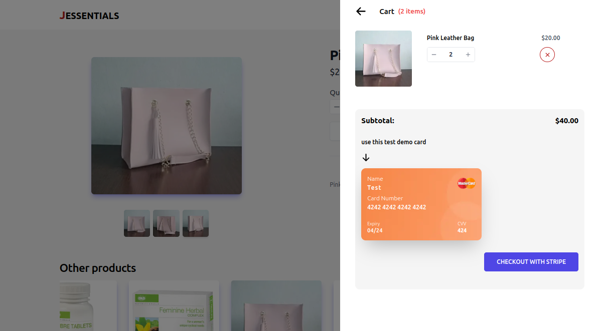
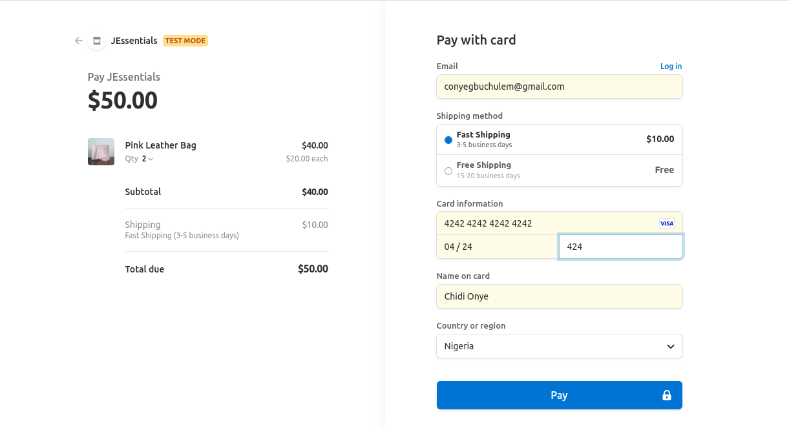

# JEssentials

An eCommerce website for small businesses.
[Website](https://jessentials.vercel.app/)

## Features

- Customers can select desired product and checkout with stripe.
- Customers can filter products based on categories.
- Customers can add, remove and modify product items in cart

## Screenshots

1. Home page with all products in different categories.
   

2. A category page showing products in same category.
   

3. A product page showing selected item with cart opened on the side.
   

4. A stripe checkout page for selected item
   

## Installation

You would need to have [Node.js](https://nodejs.org/en/) and [yarn](https://yarnpkg.com/) installed.

To install dependencies, you can run:

```bash
yarn
```

## Running the project

To run the project locally, in the project directory, run:

```bash
yarn dev
```

Runs the app in the development mode.<br />
Open [http://localhost:3000](http://localhost:3000) to view it in the browser.

## Technologies used

- NextJS and TypeScript: used to build the UI components
- Sanity: to manage the ecommerce products and content experiences; serves as backend
- Tailwind for general styles.
- React Context: for local state
- React Query: for managing server state
- Stripe : to manage checkout
- Eslint for linting and Prettier for code formating
- Deployed with vercel
